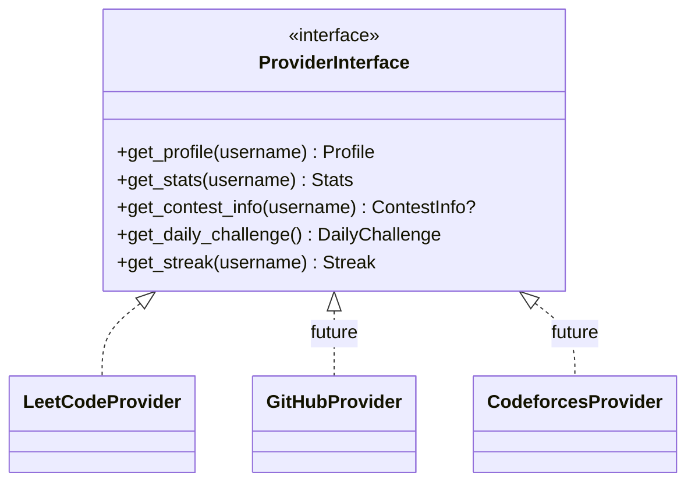
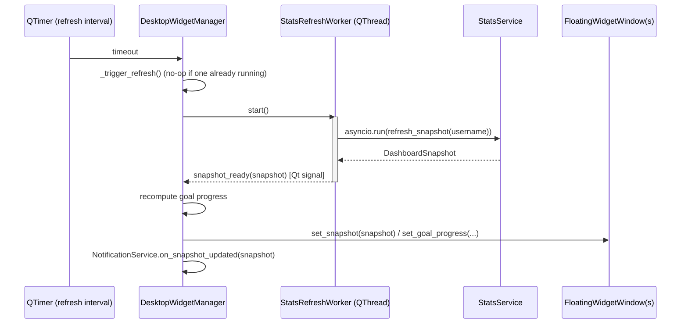
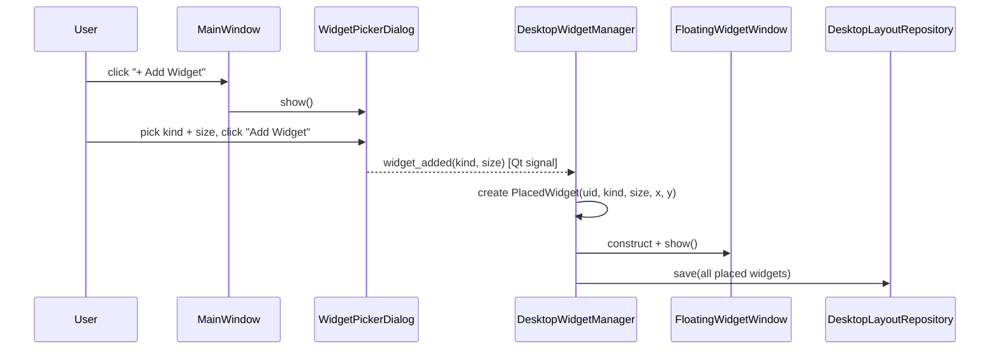

# Architecture

CodePulse follows clean architecture (a.k.a. ports & adapters). Four layers,
one dependency rule: **source code dependencies always point inward**. Outer
layers know about inner layers; inner layers know nothing about outer ones.

```mermaid
flowchart TB
    subgraph Presentation["Presentation Layer (PySide6)"]
        P1[MainWindow / FloatingWidgetWindow / Dialogs]
        P2[DesktopWidgetManager]
        P3[ThemeManager]
        P4[StatsRefreshWorker (QThread)]
    end
    subgraph Infrastructure["Infrastructure Layer"]
        I1[Providers: LeetCode, future GitHub/Codeforces/...]
        I2[Persistence: SQLite cache + JSON repositories]
        I3[Notifications: WindowsNotifier]
        I4[Config / Logging / Windows startup]
    end
    subgraph Application["Application Layer"]
        A1[StatsService]
        A2[GoalService]
        A3[NotificationService]
    end
    subgraph Domain["Domain Layer"]
        D1[Models: Profile, Stats, Streak, ContestInfo, DailyChallenge, Goal, PlacedWidget]
        D2[Interfaces: ProviderInterface, CacheRepository, *Repository, Notifier]
    end

    Presentation --> Application
    Infrastructure --> Application
    Application --> Domain
    Infrastructure -.implements.-> Domain
```

Only the domain layer is completely dependency-free (no PySide6, no httpx, no
SQLite). Everything else depends inward on it, either directly (application)
or by implementing its interfaces (infrastructure). This is what lets the UI
be swapped, the storage engine be swapped, or a new provider be added without
touching business logic.

## The desktop widget model

CodePulse is not a single dashboard: the user assembles their desktop from
independent floating widgets (Streak, Progress, Contest, Rating, Daily
Challenge, Recent Activity, Goals, Badges), each in small/medium/large sizes,
added one at a time from a picker gallery. This shapes almost everything
below: there's a many-small-windows lifecycle to manage, not one dashboard to
refresh.

- `WidgetKind` + `WidgetSize` identify *what* to render.
- `PlacedWidget` (domain) is the persisted record of *which* widgets exist
  and where, saved via `DesktopLayoutRepository`.
- `WidgetPickerDialog` is the "Add Widget" gallery (sidebar + live preview).
- `FloatingWidgetWindow` wraps one `PlacedWidget` as an actual always-on-top
  window, rendering its content via `registry.render_widget(kind, size,
  theme, snapshot, goal_progress)`.
- `DesktopWidgetManager` owns the whole fleet: spawning/destroying windows,
  persisting layout changes, propagating theme/opacity changes, and driving
  the data refresh cycle described below.

## Layer responsibilities

### `codepulse/domain/`

Pure Python. Pydantic models for `Profile`, `Stats`, `Streak`, `ContestInfo`,
`DailyChallenge`, `Goal`, `PlacedWidget`, `UserPreferences`, plus the
abstract interfaces (`ProviderInterface`, `CacheRepository`,
`SettingsRepository`, `DesktopLayoutRepository`, `GoalRepository`,
`NotificationStateRepository`, `Notifier`) that outer layers implement.
Domain exceptions live here too (`ProviderError`, `RateLimitError`,
`InvalidUsernameError`, `*PersistenceError`, ...). Nothing in this layer
imports PySide6, httpx, or sqlite3 — it is the one part of the codebase that
is trivially unit-testable and reusable if the UI or storage backend is ever
replaced.

### `codepulse/application/`

Use-case orchestration, depending on domain interfaces only:

- **`StatsService`** — fetches profile/stats/streak/daily-challenge/contest
  info concurrently (`asyncio.gather`) into one `DashboardSnapshot`, caches
  it, and serves the offline-first cache-then-refresh flow.
- **`GoalService`** — add/remove/list user-defined goals and compute each
  one's current value and percent-complete from a `DashboardSnapshot`.
  Progress computation lives here (not on the `Goal` domain model) because
  it needs `DashboardSnapshot`, which is an application-layer concept.
- **`NotificationService`** — decides when a real, notification-worthy event
  has happened (goal crossed 100%, streak hit a new all-time high, the
  once-daily challenge reminder) and calls a `Notifier` port to show it.
  Dedup state persists across restarts so the same achievement doesn't
  re-fire every refresh.

### `codepulse/infrastructure/`

Everything that talks to the outside world.

- `providers/leetcode/` — an httpx-based GraphQL client, a raw-JSON-to-domain
  mapper, and `LeetCodeProvider` implementing `ProviderInterface`. A
  `registry` maps a platform name to a provider instance; adding Codeforces
  later means adding `providers/codeforces/` with the same shape and a
  registry entry — zero changes to application or presentation code.
- `persistence/` — SQLite-backed `CacheRepository`, plus JSON-file
  repositories for settings, the desktop layout, goals, and notification
  state, all sharing one pattern: atomic writes (temp file + `os.replace`)
  and corrupt-file recovery (back up, log, fall back to defaults) instead of
  crashing.
- `notifications/` — `WindowsNotifier`, wrapping the `windows-toasts`
  library. Registers a proper Application User Model ID before constructing
  the toaster (see "A real bug worth knowing about" below) and degrades to a
  logged no-op on any failure.
- `os/` — `windows_startup.py`, a per-user Windows "Run" registry entry for
  "start with Windows".
- `config/` — `pydantic-settings`-based `AppSettings` (env-driven, developer
  facing) plus the resolved on-disk paths for every JSON/SQLite file.
- `logging/` — `loguru` setup with rotation, intercepting stdlib `logging`
  (used by httpx) so everything ends up in one place.

### `codepulse/presentation/`

PySide6 only. `FramelessWindow` is the shared base for every window
(rounded corners, translucent background, best-effort Windows acrylic blur,
native OS-driven drag/resize). `MainWindow` is a small control-panel
launcher (tray icon, theme cycling, Settings/Add-Widget entry points) —not
a dashboard. `DesktopWidgetManager`, `FloatingWidgetWindow`,
`WidgetPickerDialog`, `SettingsDialog`, and `GoalsDialog` make up the rest
of the widget system. The UI never imports `httpx` or talks to a provider
directly — it calls application services, which return domain models or
DTOs.

## Provider extensibility



The registry in `infrastructure/providers/registry.py` maps a platform
identifier (e.g. `"leetcode"`) to a provider instance. The application layer
asks the registry for "the active provider" and calls the interface methods
— it never imports a concrete provider class. New platforms are additive: a
new folder under `infrastructure/providers/`, a registry entry, and (if the
platform exposes new stat types) a domain model addition.

Not every widget kind has a backing provider method yet: Contest (upcoming
contest schedule) and Rating (historical rating-by-contest) have no
corresponding query in the LeetCode provider today, so those two widgets
render representative sample data — see each renderer module's docstring
for the specific gap.

## Threading model

PySide6's event loop is single-threaded and must never block on I/O.
`StatsRefreshWorker` is a `QThread` subclass whose `run()` calls
`asyncio.run(stats_service.refresh_snapshot(username))` and reports the
result back exclusively through Qt signals (`snapshot_ready`,
`refresh_failed`). The UI thread never awaits a coroutine and never calls
`httpx` directly — `DesktopWidgetManager` starts the worker, connects to its
signals, and returns immediately.



## Adding a widget: end-to-end flow



## Caching & offline strategy

1. On startup, `DesktopWidgetManager.restore_saved_layout()` loads the last
   cached `DashboardSnapshot` (if a username is configured) and spawns every
   previously-placed widget already showing that data — nothing is ever
   blank if prior data exists.
2. A background refresh kicks off immediately after, via
   `StatsRefreshWorker`, and repeats on the configured interval.
3. On success, the cache is updated and every open widget re-renders with
   the fresh data. On failure (no internet, rate limit, API error), the
   cached data stays on screen and the failure is logged — the app never
   crashes or blanks out.

## Configuration

`AppSettings` (pydantic-settings) reads defaults, then environment variables
(see `.env.example`) — this is developer/ops-facing configuration (log
level, data directory), not something the end user edits. `UserPreferences`
is the user-facing counterpart: username, theme, opacity, refresh interval,
cache duration, always-on-top, start-with-Windows, animations, and
notifications, edited through `SettingsDialog` and persisted via
`JsonSettingsRepository`. Goals and the desktop layout are separate JSON
files for the same reason `NotificationState` is separate from both: each
is a distinct concern with its own lifecycle, not a single "app state blob".

## A real bug worth knowing about

`windows-toasts` accepts an arbitrary, unregistered application ID without
raising — but Windows silently drops any toast sent under an ID it can't
resolve to a known app. `show_toast()` "succeeds" and nothing appears. This
was only caught by sending a real notification and watching for it, not by
any unit test. The fix (`WindowsNotifier._register_aumid()`) registers a
proper Application User Model ID (one registry entry plus
`SetCurrentProcessExplicitAppUserModelID`) before constructing the toaster
— the same thing an installed app with a Start Menu shortcut gets for free.
It's a good example of why `docs/deployment.md`'s manual verification step
exists alongside the automated test suite.
